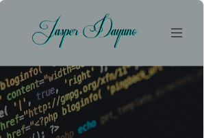

# JasperDayuno_T1A2

## Purpose

The goal of this portfolio is to showcase my skills, knowledge, passion, and what I have learned so far in the academy. The aim is to show potential employers in the IT world my skills, as well as the positive energy and professionalism that I bring to the table.

## Target Audience
As a beginner web developer, this portfolio website was created to show my passion for learning to employers by emphasising foundational skills. It features a straightforward layout for easy navigation, demonstrating readiness to make valuable contributions within the industry.

## Site map

## Functionality and features

### navigation bar
Desktop navigation features a visible menu bar with clear categories, aiding quick navigation. Hamburger navigation condenses the menu into an icon, conserving screen space. Both engage audiences by providing intuitive access to desired content, optimising user experience.

### Hero image
A hero image instantly grabs attention with striking visuals. It sets the tone and captures audience interest, encouraging further exploration. With compelling imagery and clear calls-to-action, it effectively prompts user engagement.

### Footer Navigation
Footer navigation contains essential links for easy access to additional information. It provides a seamless browsing experience by offering navigation options at the bottom of each page, enhancing user satisfaction by ensuring comprehensive accessibility.

### Contact Form
A simple, user-friendly interface encourages interaction, promoting engagement by facilitating direct communication. It builds trust and credibility by demonstrating accessibility and responsiveness to user inquiries.

## Website link 
 https://jaspertadiya.netlify.app/

## Link to Github Repo
https://github.com/JTD20123/JasperDayuno_T1A2

# Tech Stack
* Html:Provides the structure for web pages.
* CSS: Styles the HTML elements, enhancing visual appeal.
* GitHub: Manages version control and facilitates collaboration on code.
* Netlify: Hosts and deploys Website.

